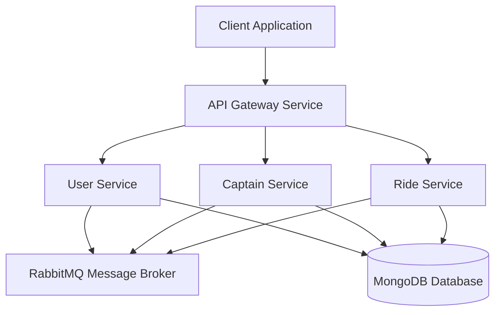
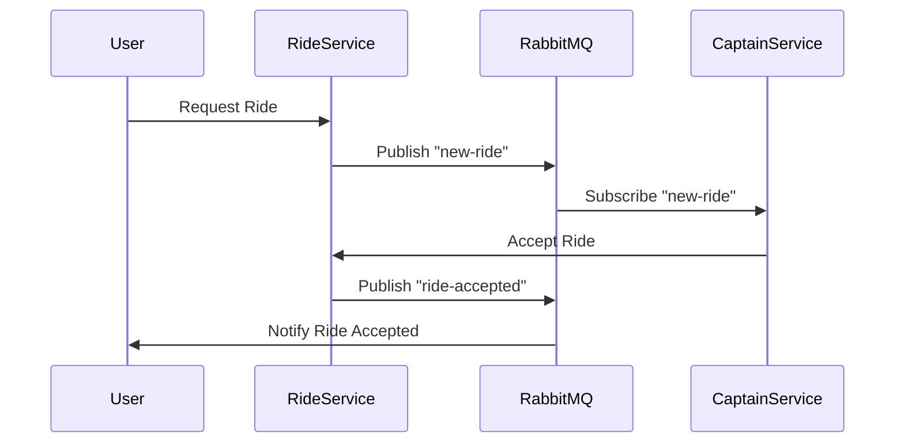

# Uber Clone - Microservices Architecture

A scalable ride-hailing application built using microservices architecture, similar to Uber. This project demonstrates the implementation of a distributed system using Node.js, MongoDB, and RabbitMQ.

## ��️ Architecture

The application follows microservices architecture with four main services:



## 🚀 Features

- User and Driver (Captain) registration and authentication
- Real-time ride request broadcasting
- Ride status management
- Driver availability toggling
- JWT-based authentication
- Message queue for service communication
- Microservices architecture
- API Gateway pattern

## 🛠️ Tech Stack

- **Backend:** Node.js, Express.js
- **Database:** MongoDB
- **Message Broker:** RabbitMQ
- **Authentication:** JWT
- **API Gateway:** Express Proxy Middleware
- **Communication:** REST APIs and Message Queues

## 📦 Prerequisites

- Node.js (v14 or higher)
- MongoDB
- RabbitMQ
- npm or yarn

## 🔧 Installation

1. Clone the repository:
```bash
git clone https://github.com/yourusername/uber-clone-microservices.git
cd uber-clone-microservices
```

2. Install dependencies for each service:
```bash
# Install User Service dependencies
cd user
npm install

# Install Captain Service dependencies
cd ../captain
npm install

# Install Ride Service dependencies
cd ../ride
npm install

# Install Gateway Service dependencies
cd ../gateway
npm install
```

3. Create `.env` files in each service directory with the following variables:
```env
# Common
JWT_SECRET=your_jwt_secret
BASE_URL=http://localhost:3000

# MongoDB
MONGO_URL=mongodb://localhost:27017/uber_clone

# RabbitMQ
RABBITMQ_URL=amqp://localhost:5672

# Service Ports
USER_SERVICE_PORT=3001
CAPTAIN_SERVICE_PORT=3002
RIDE_SERVICE_PORT=3003
GATEWAY_PORT=3000
```

## 🚀 Running the Application

1. Start MongoDB and RabbitMQ services

2. Start each service in separate terminals:
```bash
# Start User Service
cd user
npm start

# Start Captain Service
cd ../captain
npm start

# Start Ride Service
cd ../ride
npm start

# Start Gateway Service
cd ../gateway
npm start
```

## 📚 API Documentation

### User Service (Port: 3001)

#### Register User
```http
POST /user/register
Content-Type: application/json

{
    "name": "John Doe",
    "email": "john@example.com",
    "password": "password123"
}
```

#### Login User
```http
POST /user/login
Content-Type: application/json

{
    "email": "john@example.com",
    "password": "password123"
}
```

#### Get User Profile
```http
GET /user/profile
Authorization: Bearer <token>
```

### Captain Service (Port: 3002)

#### Register Captain
```http
POST /captain/register
Content-Type: application/json

{
    "name": "Mike Driver",
    "email": "mike@example.com",
    "password": "password123"
}
```

#### Toggle Availability
```http
PATCH /captain/toggle-availability
Authorization: Bearer <token>
```

#### Wait for New Ride
```http
GET /captain/new-ride
Authorization: Bearer <token>
```

### Ride Service (Port: 3003)

#### Create Ride
```http
POST /ride/create-ride
Authorization: Bearer <token>
Content-Type: application/json

{
    "pickup": "123 Main St",
    "destination": "456 Park Ave"
}
```

#### Accept Ride
```http
PUT /ride/accept-ride?rideId=<ride_id>
Authorization: Bearer <token>
```

## 📊 System Performance

- **Local Development:** ~200 requests/minute
- **AWS Free Tier:** ~50-70 requests/minute
- **AWS Standard:** ~800-1000 requests/minute

## 🔒 Security Features

- JWT-based authentication
- Password hashing using bcrypt
- Token blacklisting
- Token expiration (1 hour)
- Secure password storage
- Basic error handling

## 📝 Database Schema

### User Model
```javascript
{
  _id: ObjectId,
  name: String,
  email: String,
  password: String (hashed),
  createdAt: Date,
  updatedAt: Date
}
```

### Captain Model
```javascript
{
  _id: ObjectId,
  name: String,
  email: String,
  password: String (hashed),
  isAvailable: Boolean,
  createdAt: Date,
  updatedAt: Date
}
```

### Ride Model
```javascript
{
  _id: ObjectId,
  captain: ObjectId (ref: 'Captain'),
  user: ObjectId (ref: 'User'),
  pickup: String,
  destination: String,
  status: Enum ['requested', 'accepted', 'started', 'completed'],
  createdAt: Date,
  updatedAt: Date
}
```

## 🔄 Message Queue Flow



## 🎯 Future Improvements

- Implement geospatial features for better ride matching
- Add payment processing
- Integrate real-time location tracking
- Implement driver rating system
- Add surge pricing
- Integrate maps and routing services
- Add comprehensive monitoring and logging
- Implement rate limiting
- Add API documentation using Swagger
- Implement comprehensive testing

## 🤝 Contributing

1. Fork the repository
2. Create your feature branch (`git checkout -b feature/AmazingFeature`)
3. Commit your changes (`git commit -m 'Add some AmazingFeature'`)
4. Push to the branch (`git push origin feature/AmazingFeature`)
5. Open a Pull Request

## 📄 License

This project is licensed under the MIT License - see the [LICENSE](LICENSE) file for details

## 👥 Authors

- Dev Preeth Singh
  
## 🙏 Acknowledgments

- Microservices architecture patterns
- Node.js community
- MongoDB documentation
- RabbitMQ documentation
